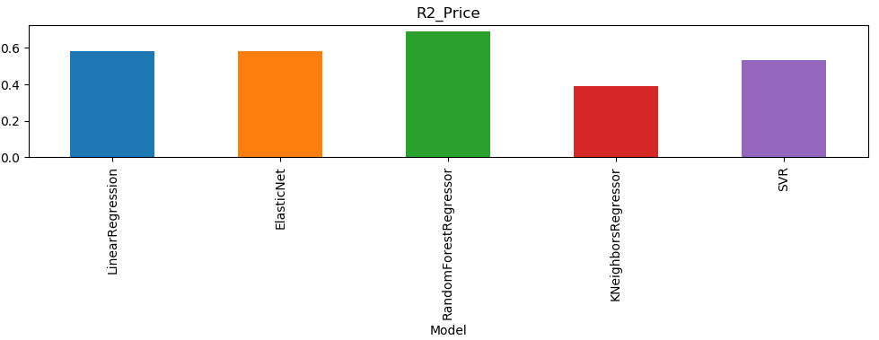
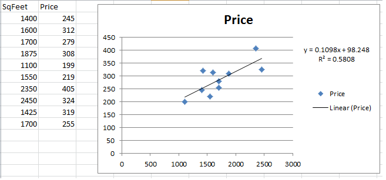

Model Performance stats
=========================

Accuracy Stats
===============
|Model		      |Accuracy   |
|---------------------|-----------|
|LinearRegression     |  0.580817 |
|ElasticNet           |  0.580817 |
|RandomForestRegressor|  0.689292 |
|KNeighborsRegressor  |  0.390584 |
|SVR                  |  0.534550 |

Procedure to run the model
============================
1. Run house_price_predictor - 
	- This shows the performance of various models
	- and persists Linear Regression model
2. Run house_price_predictor_api - 	
	- This will bring up the server and run from port 5200
3. Use make_api_request (to access https://localhost:3200/api ) 
	- Place nginx.conf in nginx folder
	- This will pass in various house areas(in sq feet), for which the house price is predicted and returned in the response.
	    

